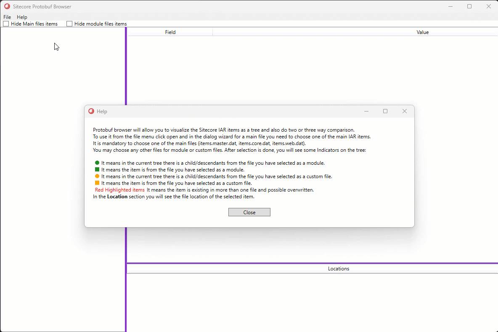
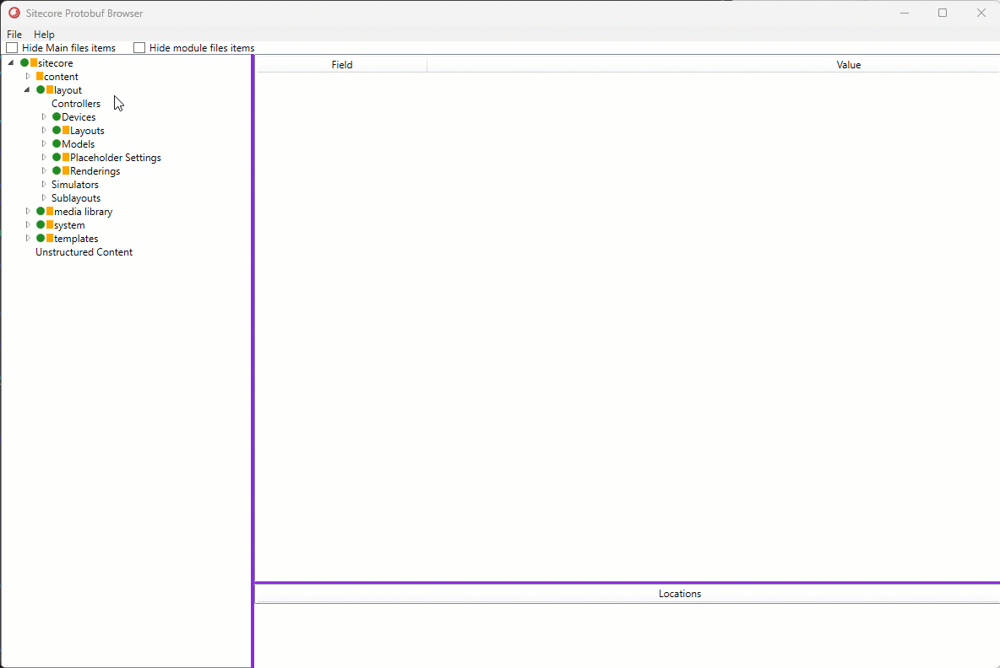

# Sitecore Protobuf Browser

Sitecore uses Protobuf to store the original/default contents of databases to the disk in these paths which are defined in the databases configs:

- ./App_Data/items/core/items.core.dat
- ./App_Data/items/master/items.master.dat
- ./App_Data/items/web/items.web.dat
- ./sitecore modules/items/...

Protobuf is a google based serializer: https://github.com/protocolbuffers/protobuf which is quite fast.

## Usecases
Here I have created a wpf app which allows you to browse this serialized files and check their contents.
It is usefull for diagnostics specially if you are using xmcloud or if you want to do sitecore upgrade and want to figure out if your seialization items has overwritten some of the original files.

## Usage
You are able to do two or three way comparison. You can choose up to three files and items shown in the content tree with some indicators:
- Green Ellipse: It means in the current tree there is a child/descendants from the file you have selected as a module.
- Green Rectangle: It means the item is from the file you have selected as a module.
- Orange Ellipse: It means in the current tree there is a child/descendants from the file you have selected as a custom file.
- Orange Rectangle: It means the item is from the file you have selected as a custom file.
- Red Highlighted items: It means the item is existing in more than one file and possible overwritten.
- In the **Location** section you will see the file location of the selected item.

The fields in parentheses are added manually for information purposes  (ex. Item id, item path).

Make sure you have the neccessary files: items.master.dat, items.core.dat, items.web.dat

### Filtering:
You can use available filters to hide the items from main or modules to have a better overview.

## Important note
Your setializtion files or Sitecore modules and basically secondary files are kind of sparse tree, that means they do not include the whole tree of the master/core/web database.
because of that you need to always have a relevant data at hand(ex. items.master.dat) and select it with the relevant module.

### Limitations:
- There is no post processing or evaluating the inheritance chain or standard values. It simply reads what is stored in the .dat files.
- There is no version selector (Latest version is used)
- There is no language selector (only English version of items is shown)
- No search capabilities in place

Project is based on .net 4.8 sdk style with xmcloud assemblies are used in project. feel free to change them to sitecore kernel and build it.

### Change log
- Context menu for field section is added to provide easier copy the values.
- Added three way comparison
- Added Location
- Added Help